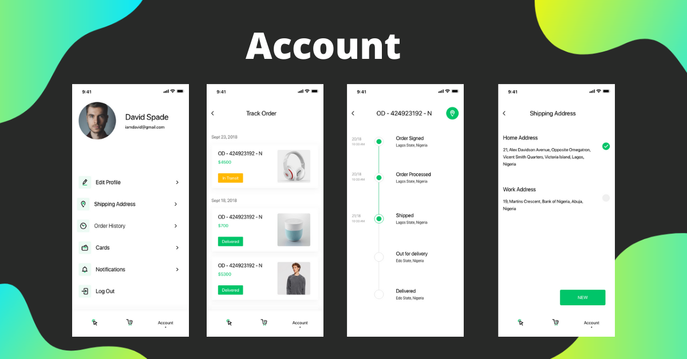
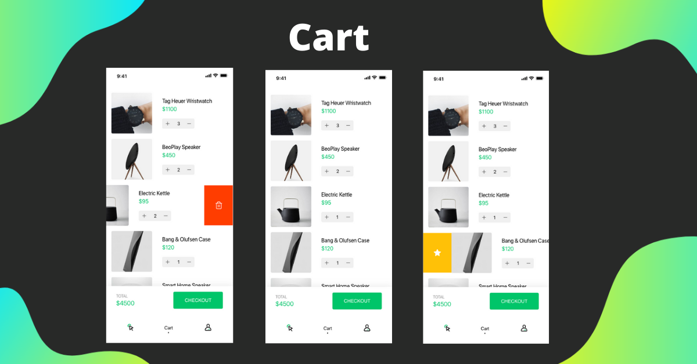
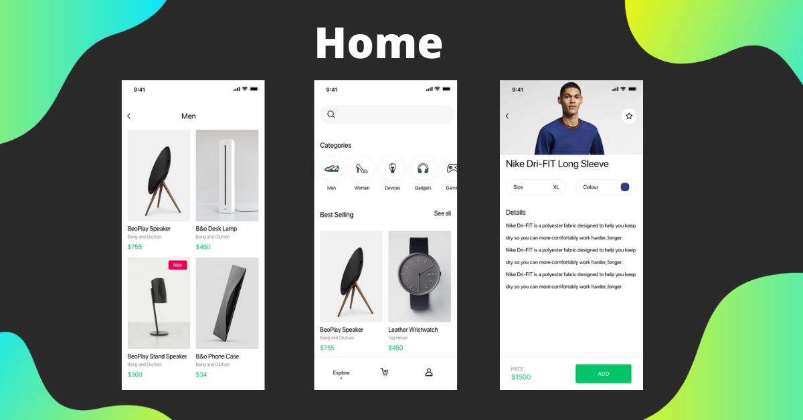
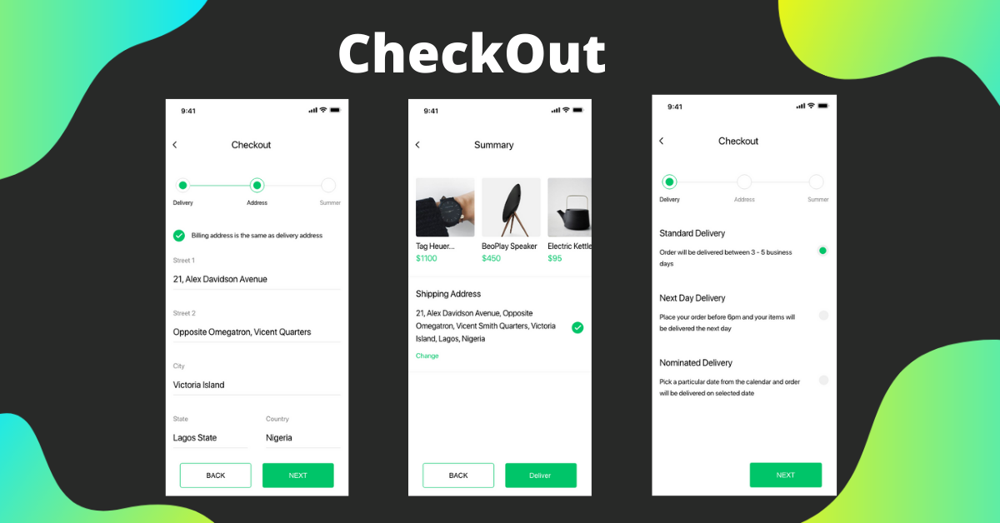

# E-Commerce Complate App - Flutter Firebase Using Get-x

In our complete e-commerce app.
we show you how you can create a nice
clean archetecture and clean design for your e-commerce app that can
run both Andriod and iOS devices because it builds with flutter.

## [Watch it on YouTube](https://www.youtube.com/playlist?list=PLV1fXIAyjeuZ2pOUkmHwzMJCJgCedrQJW)

### Video Preview of Final UI

## Screens it contains:

=> Splash

=> Login

=> Forgot Password

=> Sign Up

=> Complete Profile

=> Home Page

=> Product Details

=> Cart

=> Order

=> Profile

=> Bottom Navigation Bar

## Photos

